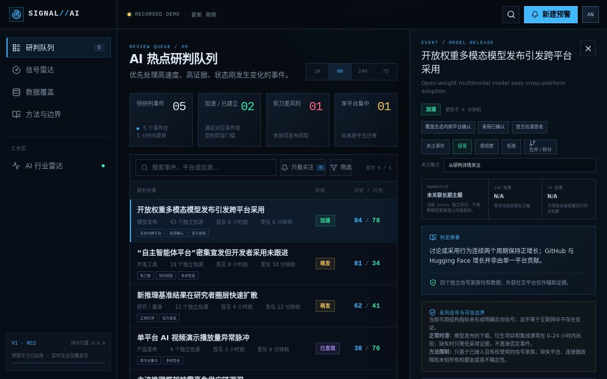

# Sites 私有候选部署证据 · 2026-07-16

## 部署结论

- 站点：`SIGNAL//AI · AI 热点雷达`
- 生产 URL：<https://signal-ai-radar-rc2-seasun.m4gicarp.chatgpt.site>
- 发布形态：Sites production deployment，owner-only 私有候选
- 访问策略：`custom`；允许用户 1，允许群组 0
- 版本：1
- 源码提交：`3088ee101469435115341ae170fd429543754dee`
- 归档内容哈希：`sha256:d09c5c5a1e0df0fb39a44f3609dcbed5dca81b887bb751df12b6a65b4ed0d8f8`
- Sites 状态：site `active`，deployment `succeeded`，failure message `null`

## 可见结果

平台截图显示：深色情报终端视觉、`RECORDED DEMO` 边界、研判队列、状态统计、搜索/筛选、选中事件详情、反向信号和结果 N/A 均被部署产物正确渲染。社交预览图、metadata 与生产依赖已进入同一构建。

## 未由本证据证明的事项

- Sites 当前只承载 Web 录制数据候选；独立 FastAPI、PostgreSQL、Redis 与 R2 未随本版本部署。
- 浏览器自动化通道被企业网络策略禁止访问 `localhost` 和该 `chatgpt.site` 域；未通过换浏览器、原始 HTTP 或 CDP 绕过。因此截图不能证明 Tab/Escape、焦点恢复、移动断点或屏幕阅读器行为。
- Owner-only Sites 身份尚未安全联邦到 FastAPI Role；原生 EventSource 的生产凭证路径仍是 Beta 阻断项。
- 本次部署不能替代 72 小时连接器 soak、7 天影子运行、真实信源规模或分析师 5 分钟研判测试。

因此，结论是“私有录制数据候选部署 GO”，不是“rc2 正式 Beta GO”。
